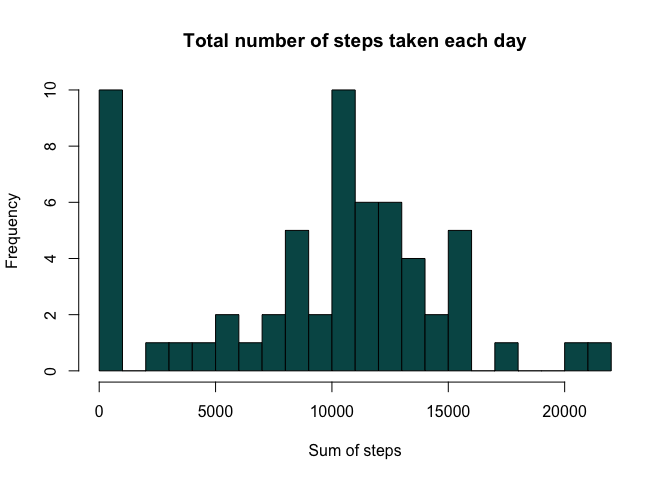
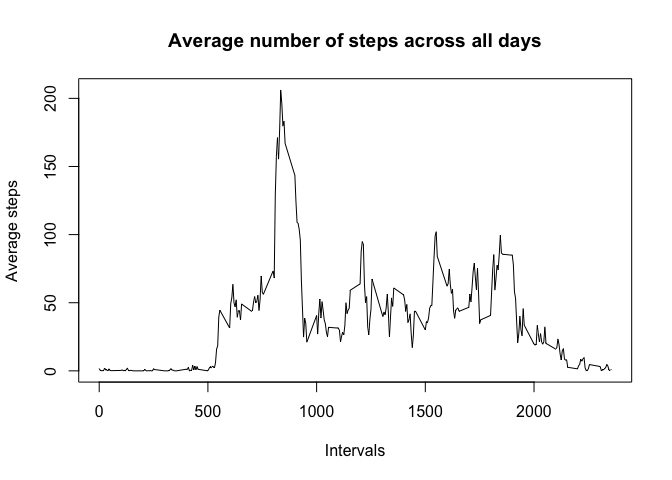
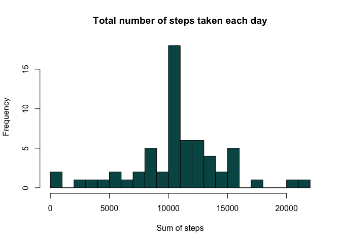
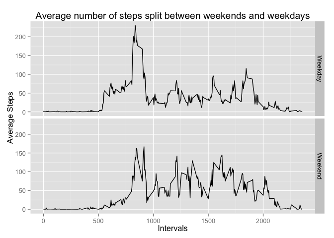

# Reproducible Research: Peer Assessment 1


This markdown file represents my submission for the Peer Assessment 1 of the Reproducible Research Class on Coursera.

In order for the script to work, the activity.csv file needs to be in the same directory, and the ggplot2 and dplyr package are required.

Happy Reading!

## Loading and preprocessing the data
As a prerequisite to the data processing and analysis, I've set the time locale to en_US.UTF-8 as well as loaded the ggplot2 and the dplyr package which will be required later on.


```r
Sys.setlocale("LC_TIME", "en_US.UTF-8")
library(ggplot2, quietly=TRUE, warn.conflicts = FALSE)
library(dplyr, quietly=TRUE, warn.conflicts = FALSE)
```

I used read.csv() function to load the csv file with columns coerced as both "integer"" for intervals & steps, and "Date" for the date column.

I also converted the data frame as a dplyr data frame object.


```r
data <- tbl_df(read.csv("activity.csv", colClasses=c("integer", "Date", "integer")))
```

## What is the total number of steps taken per day?

In order to aggregate the number of steps by day, I used the group_by() and the summarize() functions from the dplyr package. I also excluded the NA values from the steps column at this stage.

the hist() function then gives me the steps distribution by day.


```r
data_gb_dt <- group_by(data, date)
data_dt <- summarize(data_gb_dt, nb_steps = sum(steps, na.rm=TRUE))

mean <- as.integer(mean(data_dt$nb_steps, na.rm=TRUE))
median <- as.integer(median(data_dt$nb_steps, na.rm=TRUE))

hist(data_dt$nb_steps, breaks=20, col="#005555"
     , main="Total number of steps taken each day", xlab = "Sum of steps")
```

 

The mean and median values of this distribution are respectively 9354 and 10395.

## What is the average daily activity pattern?

I used the same group_by() and the summarize() functions to aggregate my dataset by interval this time, still without the NA values.


```r
data_gb_int<- group_by(data, interval)
data_int <- summarize(data_gb_int, avg_steps = mean(steps,na.rm=TRUE))

max_interval <- data_int$interval[which.max(data_int$avg_steps)]

plot(data_int$interval, data_int$avg_steps, type="l"
     , xlab="Intervals", ylab="Average steps"
     , main="Average number of steps across all days")
```

 

The 5-minute interval which contains the maximum number of steps is 835.

## Imputing missing values

In order to fill in the NA values, I used the average number of steps by interval, which is much more representative of the actual activity distribution than the average steps by day. This is due to the fact that the activity is very time-sensitive (day vs night for example).

For that purpose, I used the sapply function to back-fill in the steps column the average steps per interval (which I computed in the previous question in the data_int dataset) for every missing value.

In the same fashion as in question 1, I subsequently aggregated the data and used the hist() function to display the new distribution with completed data.


```r
data_nafill <- data
data_nafill$steps[is.na(data_nafill$steps)] <- 
    sapply(data_nafill$interval[is.na(data_nafill$steps)]
              , function(x) data_int$avg_steps[data_int$interval==x])

data_gb_dt_nafill <- group_by(data_nafill, date)
data_dt_nafill <- summarize(data_gb_dt_nafill, nb_steps = sum(steps, na.rm=TRUE))

mean_nafill <- as.integer(mean(data_dt_nafill$nb_steps, na.rm=TRUE))
median_nafill <- as.integer(median(data_dt_nafill$nb_steps, na.rm=TRUE))

hist(data_dt_nafill$nb_steps, breaks=20, col="#005555"
     , main="Total number of steps taken each day", xlab = "Sum of steps")
```

 

The mean and median values are respectively 10766 and 10766.
They are higher than for the previous distribution as all previous NA values counted as 0 values and therefore decreased the mean.

Since the average values per interval were taken, it is logical that all the NA values are now in the average bracket whose frequency therefore almost doubled.

## Are there differences in activity patterns between weekdays and weekends?

With the mutate() function from the dplyr package, I added a new factor variable in the dataset to define whether a specific date is a weekday or during the weekend. I set the time local to en-US because of the weekdays() function which previously returned the day of the week in my local system's language.

I then used the facets feature of the ggplot2 package to display a panel plot.


```r
data_nafill <- mutate(data_nafill, isWE 
                      = as.factor(ifelse(weekdays(date, abbreviate=TRUE) 
                                         %in% c("Sat","Sun"),"Weekend","Weekday")))

data_gb_intwe_nafill<- group_by(data_nafill, interval, isWE)
data_intwe_nafill<- summarize(data_gb_intwe_nafill, avg_steps = mean(steps,na.rm=TRUE))

qplot(interval, avg_steps, data=data_intwe_nafill, geom = "line"
      , xlab = "Intervals", ylab = "Average Steps"
      , main = "Average number of steps split between weekends and weekdays"
      , facets = isWE ~ .)
```

 

We can observe from both graphs that (as expected) there is more activity in early morning until the interval 900, probably representing the morning commute to work.
